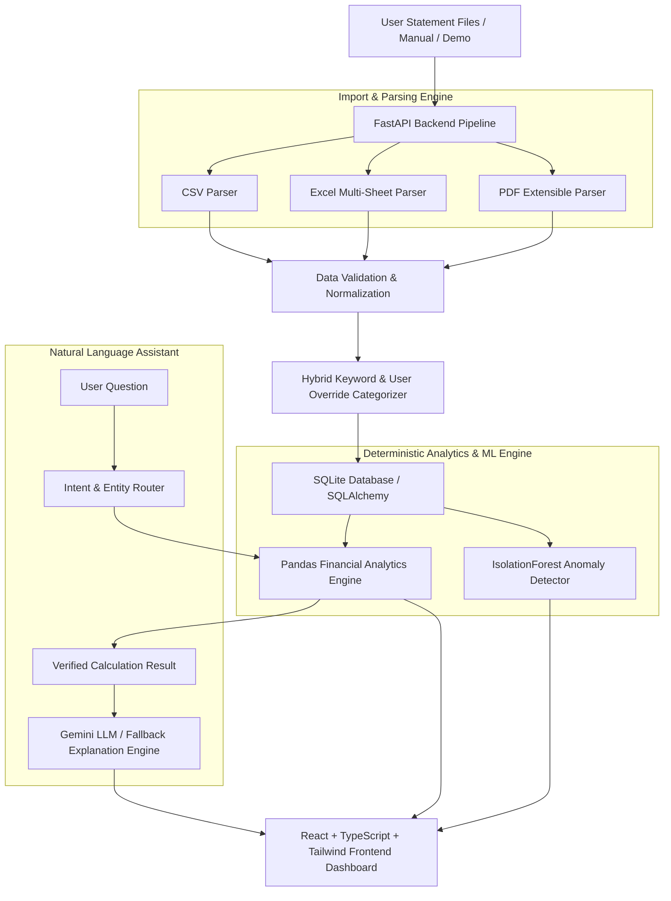

# MoneyLens AI — Personal Expense & Financial Insights Assistant

> **See your spending. Understand your money. Spend smarter.**

MoneyLens AI is a privacy-first, production-quality AI-powered personal expense analysis application. It empowers users to analyze transaction data, categorize expenses, detect spending anomalies, visualize financial patterns, and ask natural-language questions **without requiring bank credentials, OTPs, or bank scraping**.

---

## 1. Executive Overview & Problem Statement

### Problem Statement
Most financial apps require users to hand over bank credentials, account passwords, or UPI PINs for screen scraping. This presents major privacy, security, and compliance risks. Furthermore, standard expense trackers only show static totals without intelligent pattern detection or natural language query capabilities.

### Solution
MoneyLens AI operates **entirely from user-provided statement files** (CSV, Excel, PDF bank statements) or manual entries. All calculations (totals, category distributions, monthly comparisons, savings math) are executed 100% deterministically using **Python & Pandas**. An **IsolationForest ML model** detects spending anomalies, while a deterministic query engine maps user questions to exact Python functions and synthesizes clear AI explanations.

---

## 2. Key Features

- 🔒 **Zero Banking Credentials Required**: Operates safely from uploaded statements or manual entry.
- 📁 **4 Flexible Import Pipelines**:
  - **CSV Upload**: Auto-detects Date, Description, Amount, Debit, Credit columns.
  - **Excel Import**: Supports `.xlsx`/`.xls` with sheet inspection and selection.
  - **PDF Bank Statement Extraction**: Extensible parser extracts tabular data, ignores bank headers/footers, and flags low-confidence records.
  - **Manual Expense Entry**: Interactive form for single transactions.
  - **Demo Dataset**: Included multi-month sample data with intentional anomalies labeled clearly as "Demo Data".
- 🏷️ **Hybrid Expense Categorization**: Built-in merchant keyword rules (e.g. Swiggy → Food, Uber → Transport) with persistent user correction memory.
- 🌲 **ML Anomaly Detection**: Scikit-Learn `IsolationForest` flags unusual spending relative to your baseline.
- 💬 **Ask MoneyLens AI Assistant**: Ask natural-language questions (e.g., *"Where am I spending the most?"*, *"Show unusual transactions"*). Math is 100% verified by Pandas—never fabricated by LLM.
- 📊 **Interactive Financial Dashboard**: Built with Recharts (Category Donut, Monthly Income vs Expense, Category Growth).
- 💡 **AI & Savings Insights**: Automated MoM trend alerts, weekend ratios, subscription totals, and safe 20% potential savings projections.
- 🛡️ **Complete Data Control**: Option to permanently wipe all database records with a single click (`DELETE /api/data`).

---

## 3. System Architecture



---

## 4. Technology Stack

- **Backend**: Python 3.12, FastAPI, Uvicorn, Pandas, NumPy, Scikit-Learn (`IsolationForest`), SQLAlchemy, Pydantic, `pdfplumber`, `pypdf`, `openpyxl`.
- **Frontend**: React 18, Vite, TypeScript, Tailwind CSS, Recharts, Lucide Icons.
- **Database**: SQLite (SQLAlchemy ORM).
- **Testing**: Pytest, FastAPI TestClient.

---

## 5. Detailed Component Workflows

### How CSV & Excel Import Works
1. Uploaded `.csv` or `.xlsx` files are read into Pandas dataframes.
2. Columns are normalized using fuzzy header matching (`date`, `description`, `amount`, `debit`, `credit`).
3. Dates are standardized to ISO `YYYY-MM-DD` (handling `DD/MM/YYYY` day-first formats).
4. Transactions are passed to the categorization engine and shown in an interactive **Review Data** preview table prior to final database commit.

### How PDF Bank Statement Extraction Works
1. Extensible parser architecture (`BaseBankParser`, `GenericPDFStatementParser`).
2. Uses `pdfplumber` for structured table extraction and line text scanning.
3. Regex patterns match date formats (`DD-MM-YYYY`, `YYYY-MM-DD`, `DD-MMM-YYYY`) and currency values.
4. Header/footer noise (e.g. *"Account Statement"*, *"Page X of Y"*, *"Opening Balance"*) is filtered out.
5. Computes a confidence score; if confidence is low, alerts the user with:
   > *Some transactions could not be confidently extracted. Please review the imported data.*

### How Categorization Works
1. First checks database user override rules (`category_rules` table).
2. Checks built-in keyword dictionary (`Swiggy/Zomato` → Food, `Uber/Ola` → Transport, `Amazon` → Shopping, `Netflix/Spotify` → Subscriptions, etc.).
3. If a user edits a transaction category in the table, MoneyLens AI saves the override rule locally to refine future categorization.

### How Anomaly Detection Works
1. Fits an `IsolationForest` model on transaction amounts and category groupings.
2. Calculates relative median/IQR thresholds per category.
3. Flagged items receive a normalized score and natural explanation (e.g., *"This transaction of ₹48,500 is 20x higher than your typical Shopping expense of ₹2,400"*).
4. Strictly labeled as **Unusual transaction** (never *"fraud"*).

### How the AI Assistant Works ("Ask MoneyLens")
```text
User Question 
      ↓
Intent Mapping (determine_intent)
      ↓
Python / Pandas Calculation (execute_analytics_for_intent)
      ↓
Verified Result
      ↓
Natural Explanation Generation (Gemini API or Fallback NL Engine)
      ↓
Final Response Displayed
```

---

## 6. Installation & Running Locally

### Prerequisites
- Python 3.10+
- Node.js v18+ & npm

### Backend Setup
```powershell
# Navigate to backend
cd backend

# Install Python dependencies
python -m pip install -r requirements.txt

# Run FastAPI server
python -m uvicorn app.main:app --reload --port 8000
```
Backend runs at `http://127.0.0.1:8000` (API docs at `http://127.0.0.1:8000/docs`).

### Frontend Setup
```powershell
# Open a new terminal and navigate to frontend
cd frontend

# Install Node dependencies
npm install

# Start Vite dev server
npm run dev
```
Frontend runs at `http://localhost:5173`.

---

## 7. Environment Variables

Create `.env` in the project root (see `.env.example`):
```env
PORT=8000
HOST=0.0.0.0
ENV=development
DATABASE_URL=sqlite:///./moneylens.db
GEMINI_API_KEY=your_optional_gemini_api_key
CORS_ORIGINS=http://localhost:5173,http://127.0.0.1:5173
```

---

## 8. Running Automated Tests

Run `pytest` inside the root workspace:
```powershell
python -m pytest backend/tests
```
All test suites verify CSV/Excel/PDF parsing, date/amount normalization, analytics math accuracy, IsolationForest anomaly detection, and API endpoints.

---

## 9. Privacy & Security Safeguards

- 🔒 **Zero Banking Credentials**: Never asks for bank usernames, passwords, OTPs, or UPI PINs.
- 🛡️ **No Third-Party Scraping**: Works 100% off user-provided files.
- 🧹 **Delete All Data**: Includes a one-click data wipe endpoint (`DELETE /api/data`).
- 🔑 **API Key Safety**: No keys embedded in frontend code. Uses environment variables and masked key displays.

---

## 10. Limitations & Future Improvements

### Current Limitations
- PDF statement parsing depends on text layer presence in PDFs (scanned image PDFs without OCR require OCR preprocessing).
- SQLite is default storage (modular SQLAlchemy design allows smooth Postgres migration).

### Future Roadmap
- Local OCR engine integration (Tesseract/EasyOCR) for scanned receipts/PDFs.
- PostgreSQL database driver option.
- Multi-currency conversion rate calculation.
